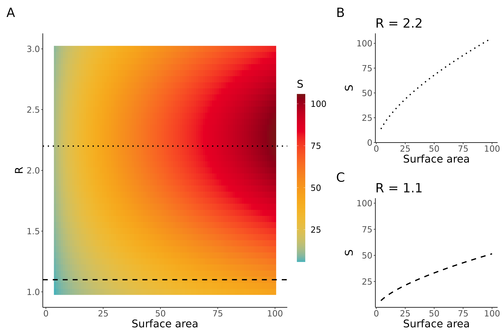
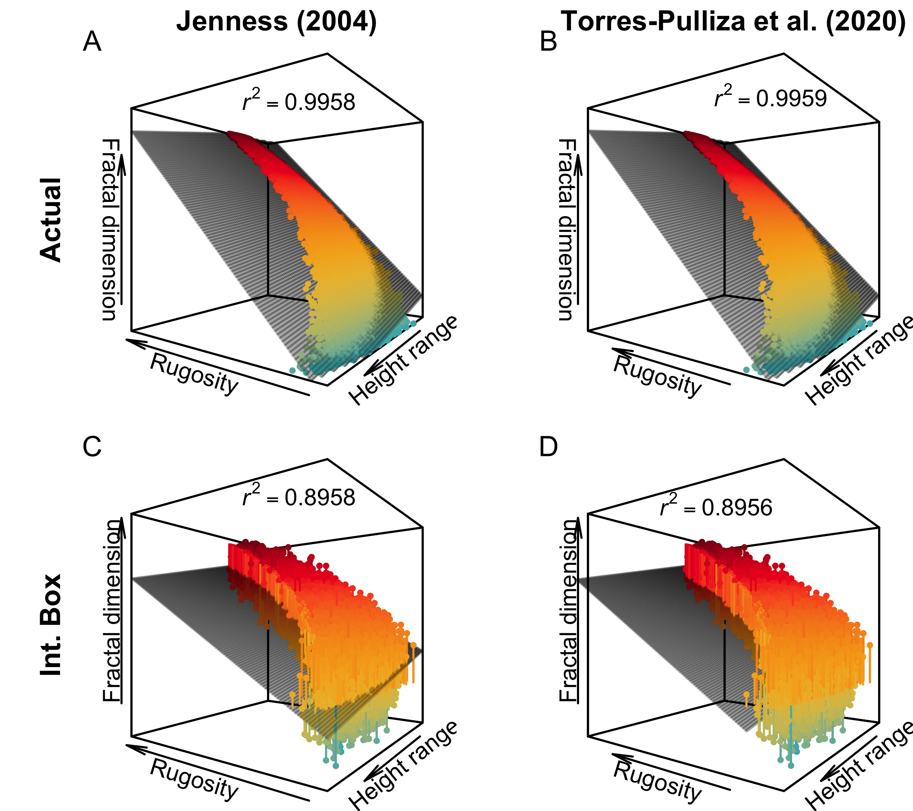

# Technical Note on Habitat Complexity

The project provides the code to reproduce the figures in Madin et al.'s Technical Note submitted to Ecology Letters titled "A word on habitat complexity" regarding the recent Synopsis "Measuring habitat complexity and spatial heterogeneity in ecology" (https://doi.org/10.1111/ele.14084).

### Abstract

In their recent synopsis, Loke and Chisholm (2022) present an overview of habitat complexity metrics for ecologists. They provide a review and some sound advice. However, we found several of their analyses and opinions misleading. This technical note provides a different perspective on the complexity metrics assessed.

### Figure 1

### Figure 2

